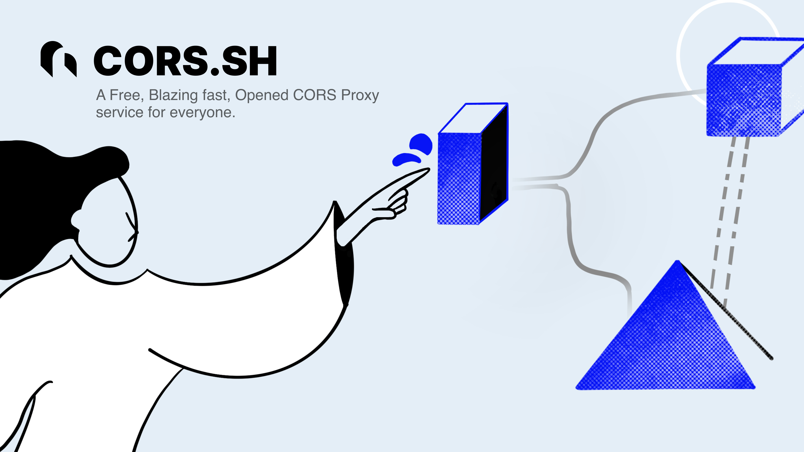

# cors.sh



The only cors proxy service all you'll ever need.

| [Website](https://cors.sh) | [Proxy (proxy.cors.sh)](https://proxy.cors.sh) | [Playground](https://cors.sh/playground) | [Docs](https://cors.sh/docs) |

## Usage

**Quick testing**
Use [cors.sh/playground](https://cors.sh/playground) for testing out your cors blocked request.

**JS**

Add `proxy.cors.sh` to your request. For example,

```js
fetch("https://proxy.cors.sh/https://example.com/");
```

## [`cors.sh/playground`](https://cors.sh/playground), The testing environment (forked from hoppscotch)

- [cors.sh/playground](https://cors.sh/playground)
- [gridaco/playground.cors.sh](https://github.com/gridaco/playground.cors.sh)
- [hoppscotch/hoppscotch](https://github.com/hoppscotch/hoppscotch)

## Projects using CORS.SH

- https://github.com/IMGROOT2/algo
- https://github.com/alejandroch1202/dollar-monitor
- https://github.com/Iconem/search-satellite-imagery/
- https://github.com/PavelLaptev/JSON-to-Figma
- https://github.com/TomRadford/shootdrop

## Contributing

Monorepo on pnpm + turbo, hosted on Cloudflare Workers (own accounts + billing). Requires Node ≥ 22.

```bash
git clone https://github.com/gridaco/cors.sh
cd cors.sh && nvm use && pnpm install
pnpm stack:up      # run the full stack locally (web + proxy + mock)
pnpm test:e2e      # run the test suite
```

See [`DEVELOPMENT.md`](./DEVELOPMENT.md) for the full local setup, [`SPEC.md`](./SPEC.md) for how the service behaves (source of truth), and [`AGENTS.md`](./AGENTS.md) if you're working with an AI coding agent.

## Disclaimer

1. This project's intend is to serve developers a reliable cors proxy service with fast response for their development.
   Using a cors proxy service to connect to your own server is not a best practice.
   We'll consistently optimize our service infra to keep the paid version affordable as possible.

2. The original code behind cors proxy is by Rob wu's cors-anywhere and the playground is forked from hoppscotch. both licensed under MIT, and our project cors.sh is also licensed under MIT License.

## TODOs

- Cost optimization - make it more cheap & provide free version to all.
- Management console - Enable usesrs to create projects as much as they want.
- OSS Application pipeline - Make OSS developers to get their api key right-on and get verified later.

## Misc

**Design file**

[Figma](https://www.figma.com/file/aPfdtNb1aGFIN9p05cmmVY/cors.sh)
